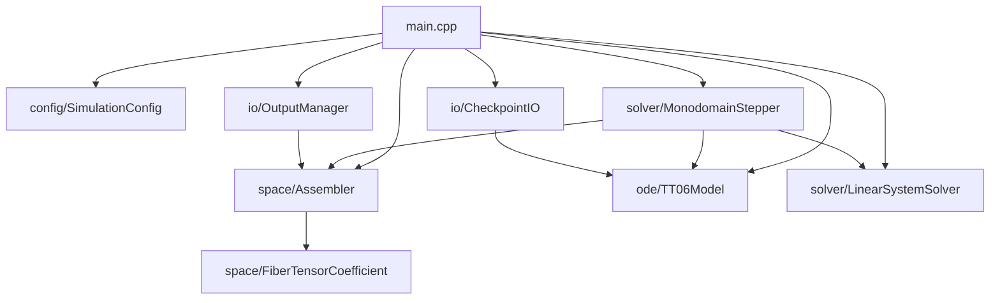
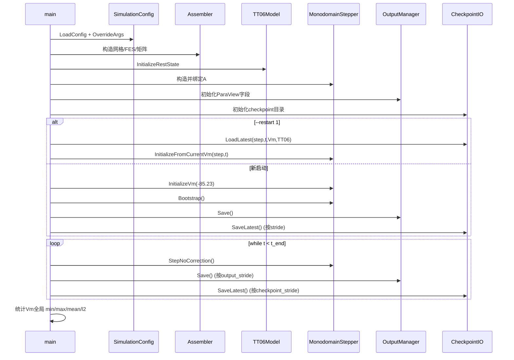
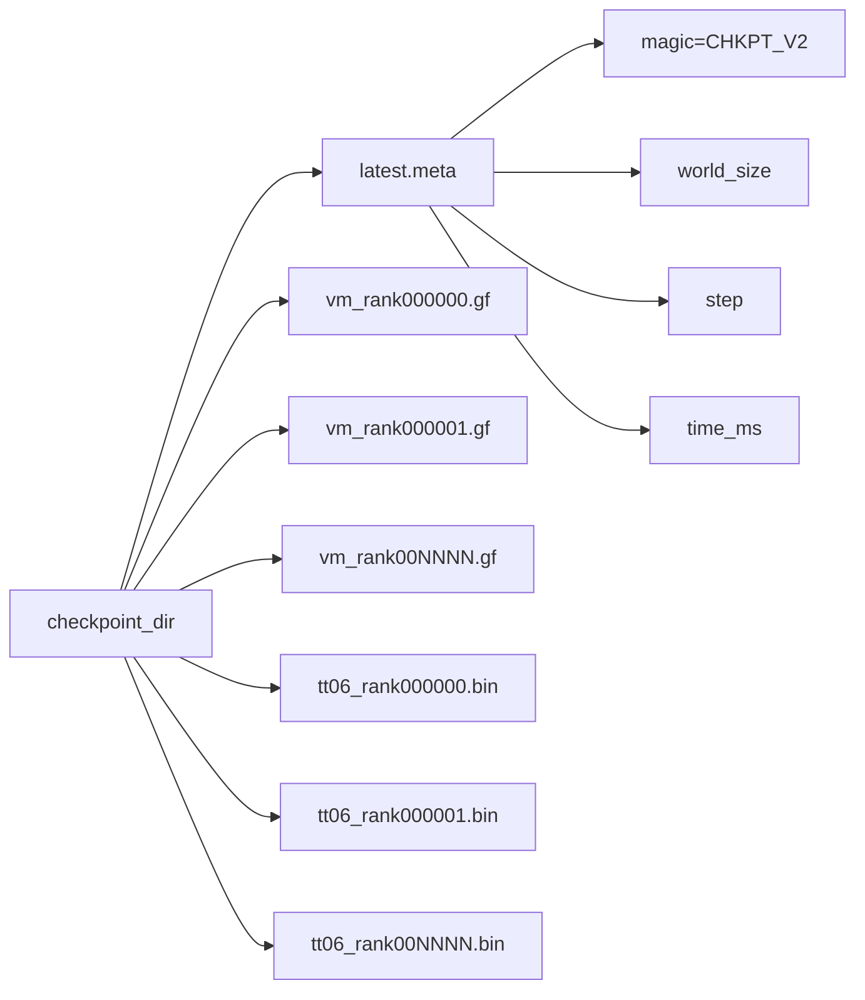

# Monodomain TT06 项目结构、逻辑与功能总览

## 1. 项目定位

本项目实现了一个基于 **MFEM + MPI** 的三维心肌单域（Monodomain）求解器，耦合 **Ten Tusscher 2006 (TT06)** 细胞电生理模型，支持：

- 文件网格或规则网格建模。
- 各向异性扩散（纤维方向张量）。
- PDE-ODE 显式分裂推进（无校正迭代）。
- ParaView 输出。
- Checkpoint 保存与重启（含多 rank 分片格式）。

入口程序：`src/main.cpp`  
核心库目标：`monodomain_core`（见 `CMakeLists.txt`）。

## 2. 代码目录结构

```text
.
|-- CMakeLists.txt
|-- cmake/
|   `-- Dependencies.cmake
|-- config/
|   |-- default.options
|   `-- niederer_50ms.options
|-- src/
|   |-- main.cpp
|   |-- config/
|   |   |-- SimulationConfig.hpp
|   |   `-- SimulationConfig.cpp
|   |-- space/
|   |   |-- Assembler.hpp
|   |   |-- Assembler.cpp
|   |   |-- FiberTensorCoefficient.hpp
|   |   `-- FiberTensorCoefficient.cpp
|   |-- solver/
|   |   |-- LinearSolverFactory.hpp
|   |   |-- LinearSolverFactory.cpp
|   |   |-- MonodomainStepper.hpp
|   |   `-- MonodomainStepper.cpp
|   |-- ode/
|   |   |-- TT06Model.hpp
|   |   |-- TT06Model.cpp
|   |   |-- tt06_generated.h
|   |   `-- tt06_generated.c
|   `-- io/
|       |-- OutputManager.hpp
|       |-- OutputManager.cpp
|       |-- CheckpointIO.hpp
|       `-- CheckpointIO.cpp
|-- tools/
|   `-- generate_niederer_case.cpp
|-- tests/
|   |-- test_config_parse.cpp
|   |-- test_tt06_single_cell.cpp
|   |-- test_fiber_gf_load.cpp
|   `-- test_restart_resume.cpp
`-- docs/
    |-- numerics.md
    |-- validation.md
    `-- architecture_full.md
```

## 3. 构建目标与产物

`CMakeLists.txt` 定义：

- 静态库：`monodomain_core`
- 可执行程序：
  - `monodomain`
  - `generate_niederer_case`
- 测试：
  - `test_config_parse`
  - `test_tt06_single_cell`
  - `test_fiber_gf_load`
  - `test_restart_resume`

依赖关系（`cmake/Dependencies.cmake`）：

- 必需：`MPI`, `MFEM`
- 可选：`PETSc`（运行时通过 `use_petsc` 开关）

## 4. 模块职责总览

### 4.1 配置模块 `src/config`

文件：

- `SimulationConfig.hpp`
- `SimulationConfig.cpp`

职责：

- 定义全局仿真参数结构体 `SimulationConfig`。
- 读取 `.options` 文本配置（`key=value`）。
- 进行基本合法性校验：
  - `dt_pde_ms > 0`
  - `dt_ode_ms > 0`
  - `dt_ode_ms <= dt_pde_ms`
  - `mesh_path` 必须提供
  - `use_fiber_gf=1` 时必须提供三条 fiber 路径
- 支持命令行覆盖（当前支持 `--use-petsc`, `--t-end`, `--dt`）。

### 4.2 空间离散与矩阵组装 `src/space`

文件：

- `Assembler.hpp/.cpp`
- `FiberTensorCoefficient.hpp/.cpp`

职责：

- 构造网格与并行有限元空间：
  - 统一从 `mesh_path` 网格文件读取。
- 初始化电压场 `Vm`（`ParGridFunction`）。
- 加载纤维方向：
  - 常量正交基（默认）
  - 或从 `fiber_f/s/n.gf` 文件读取并投影到目标空间
- 组装矩阵：
  - 质量矩阵 `M`
  - 刚度矩阵 `K`（扩散张量由 `FiberTensorCoefficient` 给出）
  - 系统矩阵
    - `A = alpha*M + 0.5*K`
    - `B = alpha*M - 0.5*K`
    - `alpha = chi*Cm/dt`

`FiberTensorCoefficient` 逻辑：

- 每个积分点读取 `f, s, n` 三向量并归一化。
- 计算扩散张量：`D = sigma_f f f^T + sigma_s s s^T + sigma_n n n^T`。

### 4.3 线性求解模块 `src/solver/LinearSolverFactory.*`

职责：

- 根据 `use_petsc` 选择求解器后端：
  - 默认路径：`mfem::CGSolver`
  - PETSc 路径：`mfem::PetscPCGSolver`（`KSPCG + PCNONE`）
- `SetOperator(A)` 绑定线性系统矩阵。
- `Solve(rhs, x)` 执行一次线性求解。

### 4.4 时间推进模块 `src/solver/MonodomainStepper.*`

职责：

- 管理时间 `t_ms_` 与步号 `step_`。
- 保存当前/下一步电压与中间向量（`vm_n_`, `vm_np1_`, `rhs_`, `iion_true_`）。
- 构造刺激掩码：
  - 优先使用 `stim_x/y/z` 盒区域。
  - 若盒参数无效，回退到 `stim_fraction`（沿 x 方向比例刺激）。
- 计算 RHS：
  - `rhs = B*Vn - chi*Cm*M*Iion + (-chi*Cm)*M*Istim`
- 执行两类推进：
  - `Bootstrap()`: 从初值执行第一步。
  - `StepNoCorrection()`: 主循环步（无校正）。
- 支持重启初始化：
  - `InitializeFromCurrentVm(step, t_ms)`。

### 4.5 离子模型模块 `src/ode/TT06Model.*`

职责：

- 封装每个本地 true dof 节点的 TT06 状态（19 states / 19 rates / 54 consts）。
- `InitializeRestState(v_rest)`：
  - 调用 CellML 生成初始化；
  - 禁用模型内置刺激（`c[51]=0`），外部刺激由 monodomain 层统一施加。
- `ComputeIion(vm_true, iion_true)`：
  - 以当前 `Vm` 代入 TT06 代数变量并汇总离子电流。
- `AdvanceStates(dt_pde, dt_ode, vm_next)`：
  - 分子步推进（`n_sub = ceil(dt_pde/dt_ode)`）
  - 门控变量使用 Rush-Larsen 更新
  - 浓度类变量使用 Forward Euler
  - 对关键钙浓度做下界截断防止数值崩溃
- `SaveState/LoadState`：
  - 以二进制序列化单 rank 本地 ODE 状态。

### 4.6 输出与重启模块 `src/io`

#### OutputManager

职责：

- 创建 ParaView 数据集合 `monodomain`。
- 注册字段：
  - `Vm`
  - `Iion`
  - （若有）`fiber_f/s/n`
- `Save(step, t, iion_true)` 按步输出 `.pvd/.pvtu/.vtu`。

#### CheckpointIO

职责：

- 保存/加载最新 checkpoint。
- 当前格式（V2）为 **多 rank 分片**：
  - `latest.meta`
  - `vm_rank%06d.gf`
  - `tt06_rank%06d.bin`
- `latest.meta` 内容：
  1. `CHKPT_V2`
  2. `world_size`
  3. `step`
  4. `time_ms`
- 加载时检查：
  - checkpoint 中 `world_size` 必须等于当前运行 `MPI size`。
- 兼容旧格式（仅 `np=1`）：
  - `vm.gf`
  - `tt06.bin`

## 5. 主程序执行逻辑

文件：`src/main.cpp`

执行流程：

1. 初始化 MPI。
2. 解析命令行：
   - `--config <path>`
   - `--restart 1|0`
3. 加载配置 + 命令行覆盖。
4. 可选初始化 PETSc。
5. 构建对象：
   - `Assembler`
   - `TT06Model`
   - `LinearSystemSolver`
   - `MonodomainStepper`
   - `OutputManager`
   - `CheckpointIO`
6. 分支：
   - 非重启：初始化静息电压，执行 bootstrap，并按 stride 输出/checkpoint。
   - 重启：从 checkpoint 加载 `step/t/Vm/TT06`，恢复时间推进状态。
7. 主循环直到 `t >= t_end_ms`：
   - `StepNoCorrection()`
   - 按 `output_stride` 输出
   - 按 `checkpoint_stride` 保存
8. 汇总并输出全局 `Vm` 统计（min/max/mean/l2）。
9. 释放 PETSc（若启用）。

## 6. 数值逻辑（当前实现）

采用无校正分裂：

1. 用 `(V^n, w^n)` 计算 `I_ion^n`。
2. 解 PDE 得到 `V^{n+1}`：
   - `A V^{n+1} = B V^n - chi*Cm*M*I_ion^n - chi*Cm*M*I_stim`
3. 用 `V^{n+1}` 推进 ODE 得到 `w^{n+1}`。

时间离散：

- 扩散项：Crank-Nicolson（通过 `A/B` 实现）
- ODE：Rush-Larsen + Forward Euler
- 不包含 predictor-corrector 或固定点迭代。

## 7. 结构图

### 7.1 模块依赖图



### 7.2 运行时序图（含重启分支）



### 7.3 Checkpoint 文件结构图（V2）



## 8. 关键配置分组

- 网格：
  - `mesh_path`
- 纤维：
  - `use_fiber_gf`
  - `fiber_f/s/n_path`
- 材料：
  - `cm_uF_per_mm2`, `chi_per_mm`
  - `sigma_f/s/n_mS_per_mm`
- 时间：
  - `dt_pde_ms`, `dt_ode_ms`, `t_end_ms`
- 刺激：
  - `stim_start_ms`, `stim_end_ms`, `stim_amp`
  - 盒刺激：`stim_x/y/z min/max`
  - 回退刺激：`stim_fraction`
- 求解器：
  - `use_petsc`, `ksp_max_it`, `ksp_rtol`
- IO：
  - `output_stride`, `checkpoint_stride`
  - `output_dir`, `checkpoint_dir`

## 9. 测试覆盖

测试文件：

- `tests/test_config_parse.cpp`
  - 配置解析与默认路径 sanity check
- `tests/test_tt06_single_cell.cpp`
  - 单细胞 `Iion` 有限值稳定性
- `tests/test_fiber_gf_load.cpp`
  - 纤维 `.gf` 加载、矩阵组装有效性
- `tests/test_restart_resume.cpp`
  - 连续运行 vs checkpoint 重启一致性（MPI 下全局误差归约）

## 10. 工具程序

`tools/generate_niederer_case.cpp`：

- 生成 Niederer 风格基准案例文件：
  - `niederer_benchmark.mesh`
  - `fiber_f.gf`, `fiber_s.gf`, `fiber_n.gf`
- 要求 `-np 1` 运行。

## 11. 当前功能边界与注意事项

- 重启要求：当前 `--restart` 必须与保存 checkpoint 的 `MPI size` 相同。
- Checkpoint 写入为“分片+meta”流程，当前未实现临时文件替换式原子写。
- ODE 状态按 rank 本地 true dof 保存，分区变化（不同 `MPI size`）不支持直接续算。
- 耦合算法为无校正分裂，强调稳定可运行路径，不追求高阶迭代耦合。

## 12. 典型运行路径

1. 编译：`cmake -S . -B build && cmake --build build -j`
2. 运行：`mpirun -np 4 ./build/monodomain --config config/default.options`
3. 重启：`mpirun -np 4 ./build/monodomain --config config/default.options --restart 1`
4. 测试：`ctest --output-on-failure -j4`（在 `build/` 下）

## 13. Whole-body 扩展（新增）

新增目录与文件：

- `src/solver/ExtracellularRecoverySolver.hpp/.cpp`
- `src/solver/TorsoPotentialSolver.hpp/.cpp`
- `src/coupling/InterfaceMapper.hpp/.cpp`
- `tools/generate_torso_box.cpp`
- `tools/generate_conforming_wholebody_case.cpp`
- `config/wholebody_default.options`
- `config/wholebody_conforming.options`
- `tests/test_wholebody_smoke.cpp`

### 13.1 新增配置项

在 `SimulationConfig` 中新增：

- `enable_wholebody`
- `use_conforming_wholebody`
- `wholebody_mesh_path`
- `torso_mesh_path`
- `heart_volume_attrs`、`torso_volume_attrs`
- `sigma_i_*`、`sigma_e_*`（fiber/sheet/normal）
- `sigma_torso_mS_per_mm`
- `interface_map_max_dist_mm`
- `torso_dirichlet_penalty`
- `heart_interface_bdr_attrs`、`torso_interface_bdr_attrs`

### 13.2 新增求解流程

当 `enable_wholebody=1`：

1. 仍先执行 `MonodomainStepper`（KSP1）。
2. `ExtracellularRecoverySolver` 在心脏网格求解 `ue`（KSP2）。
3. `InterfaceMapper` 将心脏 `ue` 映射到躯干约束 true dof。
4. `TorsoPotentialSolver` 在躯干网格求解 `uT`（KSP3）。

当 `use_conforming_wholebody=1` 时，流程会先从单一 parent mesh 构造
`ParSubMesh(heart)` 与 `ParSubMesh(torso)`，然后分别驱动 KSP1/KSP2/KSP3。

### 13.3 InterfaceMapper 设计

- 双网格（独立 heart/torso mesh）模式：
  - 输入：心脏边界 true dof 坐标、躯干 true dof 坐标。
  - 预处理：全局收集心脏边界采样点（`MPI_Allgatherv`）。
  - 映射：躯干每个 true dof 找最近心脏边界点，距离小于 `interface_map_max_dist_mm` 才纳入约束集。
  - 运行时：每步只同步心脏边界 `ue` 值，再写入躯干约束向量。

- conforming（单一 parent mesh + `ParSubMesh`）模式：
  - 预处理：首次读网格时构建 `parent_vertex_id -> heart owned true dof` 索引。
  - 映射：`torso` 顶点按 `parent_vertex_id` 直连到 `heart` 样本（无全局最近邻搜索）。
  - 运行时：每步仅同步 heart 接口样本值（`Allgatherv`），按索引写入 torso 约束 true dof。

双网格模式下，映射本质是近邻投影近似。  
conforming 模式下，heart/torso 接口节点可精确对齐，映射距离应接近 0。

### 13.4 OutputManager 扩展

- 心脏数据集输出：`Vm`、`Iion`、`ue`（以及纤维场）。
- 躯干数据集输出：`uT`。
- 路径：
  - `output/.../heart`
  - `output/.../torso`

### 13.5 工具链扩展

- `generate_torso_box`：读取心脏网格包围盒，外扩 `padding` 后生成四面体规则盒网格。
- `generate_conforming_wholebody_case`：生成单一 conforming whole-body 网格，并用 volume attribute 区分 heart/torso。
- 典型命令：
  - `mpirun -np 1 ./build/generate_torso_box --heart-mesh ... --out-mesh ... --padding-mm 8 --h-mm 1`
  - `mpirun -np 1 ./build/generate_conforming_wholebody_case --heart-mesh ... --out-mesh ... --heart-attr 1 --torso-attr 2`

### 13.6 当前 whole-body 边界与后续建议

- 当前躯干约束为 penalty 形式，优势是并行稳健、实现简单；代价是非严格强制 Dirichlet。
- 双网格模式仍有接口插值误差；conforming 模式已可避免几何不匹配误差。
- 若目标是高精度 ECG 对比与大规模并行效率，下一步建议：
  - 继续优化 parent-id 直连映射（减少通信量，避免全局 allgather）
  - 使用精确界面施加（非 penalty 的对称消元或混合方法）
  - ECG 电极采样/12 导联模块标准化。
